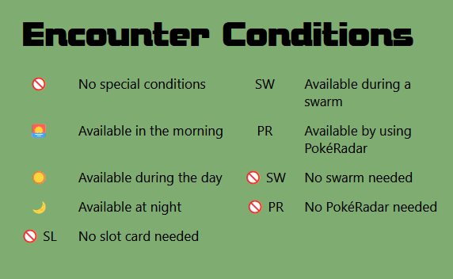

# encounterDex

is an encyclopedia of Pokémon available on all the routes and areas of the main Pokémon series entries. For every route of each game, encounterDex lists the Pokémon available by walking, surfing and fishing and filtered by various encounter methods. It also lists the chance of catching them and their available levels.

## Creator information

Creator: Jim Lougheed

Email: jims.codes@gmail.com

GitHub: https://github.com/jim-lougheed/

Twitter: https://twitter.com/JimsCodes

LinkedIn: https://www.linkedin.com/in/jim-lougheed/

## Available Scripts

In the project director, you can run:

## In `client` folder

### `npm start`

This runs the app in the development mode.\
Open [http://localhost:3000](http://localhost:3000) to view it in your browser.

The page will reload when you make changes.\
You may also see any lint errors in the console.

## In `server` folder

### `npm start`

This launches the server and makes relevant API calls.

## Features

From the home page, users can select the game they are playing to access that route.

At any point, the user can select a different game by clicking on the selection (not available for mobile view, but the home page is accessible via the "Go back" button).

Once a game is selected, the user can select a route or area from the drop-down menu.

The Walking section displays all Pokémon available by walking in the grass. There are 3 tabs:
Standard, PokéRadar and Swarm. Click on each to toggle Pokémon available with the selected method.

The Surfing section displays all Pokémon available by surfing on the water.

The Fishing section displays all Pokémon available by using a rod in the water. There are 3 tabs, one for each rod:
Old Rod, Good Rod and Super Rod

The legend advises on what each of the encounter condition symbols/abbreviations on each Pokémon card refer to.

## Tech Stack

### [React](https://reactjs.org/)

Created with `create-react-app` using the React JS library.

### [PokéAPI](https://pokeapi.co/)

Web API that retrieves a variety of information about Pokémon and related data.

### [Material UI](https://mui.com/)

Built with Material UI framework components.

### [Node.js](https://nodejs.org/en/)

Runs server.

### [Express](http://expressjs.com/)

Express web framework for Node.js.

### [Axios](https://axios-http.com/)

Axios HTTP client makes API calls to spoonacular API.

### [SASS](https://sass-lang.com/)

CSS extension language used with BEM naming principles.

## Roadmap

encounterDex currently hosts capabilities to search route information for all main Pokémon series games. However, only information for Diamond, Pearl and Platinum are available through using the site's interface.

The ability to retrieve Pokémon encounter information for other games will be added series by series as the Selection component is updated.

The adding of encounter information for other game entries may require new components due to varying methods in the games, and so this may take longer.

Furthermore, once all games are searchable, further functionality will be added to the application, such as the ability to search by Pokémon.

## Support

Contributions, issues, and feature requests are welcome!
Give a ⭐️ if you like this project!
